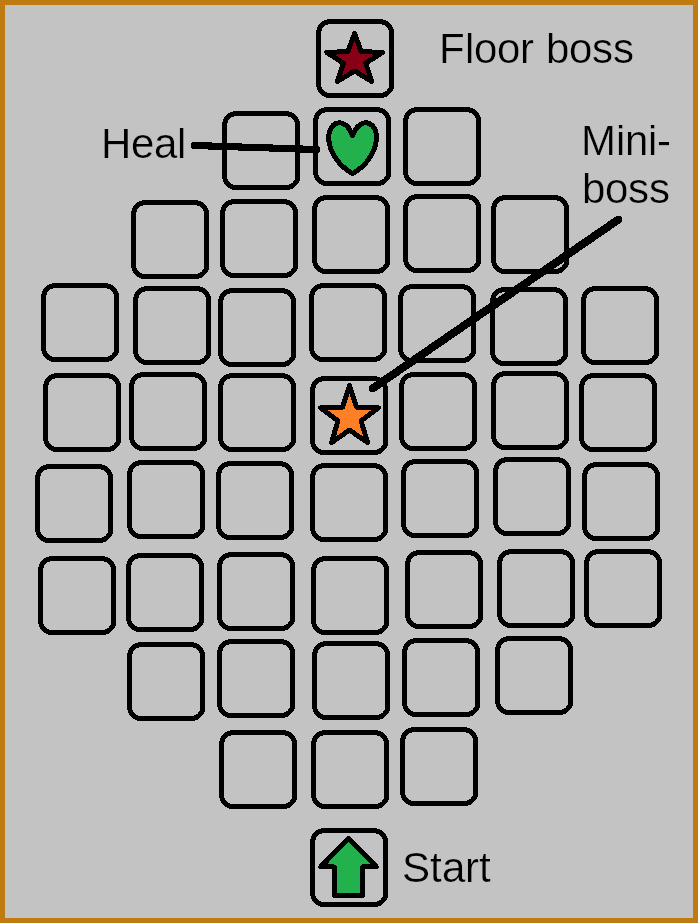
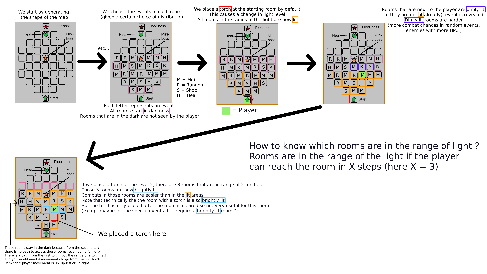

# Table of contents

- [Disclaimer](#disclaimer)
- [Cards](#cards)
	- [Effects](#effects)
	- [Status](#status)
- [Entity](#entity)
- [Map](#map)
	- [Rooms](#rooms)
	- [Events](#events)
	- [Light mechanic](#light-mechanic)
- [Animation](#animation)

# Disclaimer

**This documentation is meant as a way to help people who want to contribute to the codebase. If you want to play the game, this will only spoil things for you.**

This documentation is not meant as an in-depth explanation of every function. It is meant as a general overview of the classes, their functions and how they interact. 

For more information, please refer to the source code and use the built-in documentation viewer (every code should be commented).

# Cards

A card is a description, an art, and data to play the effects of the card

## Effects

Effects are the basis of the interactio, between the card and the game. Let's take an example right away:

Slap : Deal 1 damage to the target

This card has one effect, it is an `EffectDamage`, with a value of 1. The effects are held inside a wrapper, `EffectData`, which holds the effect, the value of the effect and other informations. The idea between the effect structure is that it is easy to stack as many effects as you want on your card. For example:

Vampire poison sting (card that doesn't exist btw): Deal 1 damage to all enemies, inflict 3 poison to the target and heal yourself for 2 HP.

All the `EffectData` (there are 3 here) are held inside the `card_effects_data` array of the card. The card will then loop through the array and play the effects one by one, ie an `EffectDamage`, an `EffectPoison` and an `EffectHeal` on the relevant targets.

## Targeting system

WiP

## Status

`Status` is the way we deal with conditions on a character that stays on them for multiple turns. For example, poison, weakness, strength... There are 2 catergories of `Status`, which are `Buff` and `Debuff`. The difference between effects and status is that effects do something when a card is played and status do something at a given time in the turn. The `EffectPoison` applies a `DebuffPoison` to the target.

Each `Entity` has an array of Status where we store said `Status`. At the start of the turn of each entity, the `Status` inside the array are applied (and the number of turns left is decreased by 1, if the status is not for the entire duration of the fight). Note that conditions that carry between fights (such as conditions provided by relics) do not qualify as `Status`, they are handled differently.

# Entity

# Map

The structure of the map is the following:

## Rooms

Rooms are the basis of the map (they are the squares you can see on the image of the map). The map is a 2D Array of rooms. Each room holds basic information about the event in this room as well as informations about the presence of a light source and the level of light in the room (see [Light mechanic](#light-mechanic) for more informations).

Players will know what events are in the room if said room is in the radius of a light (or the player is immediately next to it). The other rooms of the map are in darkness and the player doesn't know the event in them before. We will use icons to show to the player what events they will encounter.

## Events

What might happen in this new room ? Mystery, mystery... Events is the way we decide what is going to happen in each room. Currently, the list of events is the following:

- Mob: an encounter with enemies
- Random: you don't know what is going to happen. Most likely, you will face a unique scenario with choices, but it might also be a mob, a shop, a heal or any other event.
- Shop: buy and sell cards
- Heal: well... as it says

Events can change depending on the level of light in the room. The distribution of events is decided at map level to have something coherent.

## Moving on the map

Players will move once the event in the room they are in is over. They must go up one floor when going in a new room. The player can go to the room directly above them or the ones on the sides. This movement pattern may change due to some relics.
The first array of the map array is the first floor, and the last array is the last floor (meaning when looking at the matrix representation of the map, the first floor is at the top and the last floor is at the bottom, matrix is upside down compared to the actual visual of the map). This makes it easier to work with indexes. 

## Light mechanic

One of the main feature of the game is the ability for the player to influence the map through his actions. The player can place a light source (refered as "torch" for now) in a room, after the event is over and before using the map. The light source will then be used to light the room and the rooms around it.

Using a light source will cause the `light level` to change in surrounding rooms. Each room in the radius of a light gains one light level from it. If a room is in the radius of effect of 2 light sources, then its light level is 2. Changing the `light level` in a room **may** cause its event to change. In simpler terms, the player can influence the encounters they will face by placing light sources in rooms as they travel.

__An example__:

You start the map at level 0. There is a torch placed here by default and you can see everything up to 3 node in every direction you can move to, so you can plan your route. This area is lit and combats/events are normal difficulty in the light radius.

You work your way up to node 3 and can now only see node level 4 that is dimly lit since it is not within torch radius. Tutorial prompts you that these combats/events will be more difficult but with greater reward (risk reward). Node levels 5 and beyond are in darkness and cannot be seen until you move next to them and they become dimly lit.

Place a torch? Y/N

You place one of your 3 torches, not feeling overconfident, and the next 3 levels are lit up(4-6). You take a path leading to 2 combats on levels 4 and 5, but you mess up the first and are worried. You can place a second torch within the radius of the first, which does 2 things. 1: causes 3 levels away to become lit(5-7). 2: Levels 5 and 6 are now brightly lit because they are in the radius of 2 torches, which makes combat/events easier.

You now have only 1 torch left, which lets you continue up to node level 10 at normal difficulty, or less at easier difficulty. You can buy more at a shop, and combats have a chance to drop one. If you have torches remaining at the end of a map, you get a bonus.

### How event changes are made

## Unique events

The player might encounter unique events on the map. They will be shown on the map as little twinkle of lights (which can be seen even if the room is in the dark). To trigger the unique event, the light level needs to be at least 2 (ie the room needs to be in range of 2 light sources). The unique event is triggered after the normal event of the room. The player can choose to not do the unique event and move on to the next room.

Special events provide unique bonuses. They can be a unique relic, only accessible through these special events, or they might be a unique dungeon with special cards. Unique events might be more difficult than normal events, which is why some players might decide to not go for them.

# Animation
